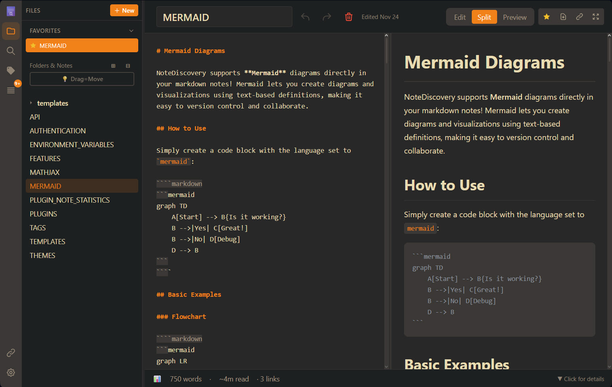

# GoNote


> Your Self-Hosted Knowledge Base
>
> [📖 中文文档](#中文文档) | [📚 Documentation](#documentation)

## What is GoNote?

GoNote is a **lightweight, self-hosted note-taking application** that puts you in complete control of your knowledge base. Write, organize, and discover your notes with a beautiful, modern interface—all running on your own server.

GoNote 是一个**轻量级、自托管的笔记应用**，让您完全掌控自己的知识库。使用美观、现代的界面编写、组织和发现笔记——全部运行在您自己的服务器上。



## Tech Stack

| Component | Technology |
|-----------|------------|
| **Backend** | Go 1.24+ with Fiber |
| **Frontend** | Vanilla JS + Alpine.js |
| **Storage** | Plain Markdown files |

## 技术栈

| 组件 | 技术 |
|------|------|
| **后端** | Go 1.24+ with Fiber |
| **前端** | Vanilla JS + Alpine.js |
| **存储** | 纯 Markdown 文件 |

## Who is it for?

- **Privacy-conscious users** who want complete control over their data
- **Developers** who prefer markdown and local file storage
- **Knowledge workers** building a personal wiki or second brain
- **Teams** looking for a self-hosted alternative to commercial apps
- **Anyone** who values simplicity, speed, and ownership

## 适合谁用？

- **注重隐私的用户**——完全掌控自己的数据
- **开发者**——偏好 Markdown 和本地文件存储
- **知识工作者**——构建个人维基或第二大脑
- **团队**——寻找自托管替代商业应用
- **任何人**——看重简单、快速和所有权

---

<p align="center">
  <a href="https://www.gonote.com"></a>
  &nbsp;&nbsp;
  <a href="https://gamosoft-gonote-demo.hf.space"></a>
</p>
<p align="center">
  <a href="https://www.pikapods.com/pods?run=gonote"></a>
  &nbsp;&nbsp;
  <a href="https://ko-fi.com/gamosoft"></a>
</p>

---

## Why GoNote?

### vs. Commercial Apps (Notion, Evernote, Obsidian Sync)

| Feature | GoNote | Commercial Apps |
|---------|---------------|-----------------|
| **Cost** | 100% Free | $xxx/month/year |
| **Privacy** | Your server, your data | Their servers, their terms |
| **Speed** | Lightning fast | Depends on internet |
| **Offline** | Always works | Limited or requires sync |
| **Customization** | Full control | Limited options |
| **No Lock-in** | Plain markdown files | Proprietary formats |

### 为什么选择 GoNote？

### 对比商业应用（Notion、Evernote、Obsidian Sync）

| 特性 | GoNote | 商业应用 |
|------|--------|----------|
| **成本** | 100% 免费 | 每月/每年 $xxx |
| **隐私** | 您的服务器，您的数据 | 他们的服务器，他们的条款 |
| **速度** | 闪电般快速 | 取决于网络 |
| **离线** | 始终可用 | 有限或需同步 |
| **定制** | 完全控制 | 有限选项 |
| **无锁定** | 纯 Markdown 文件 | 专有格式 |

### Key Benefits

- **Total Privacy** - Your notes never leave your server
- **Optional Authentication** - Simple password protection for self-hosted deployments
- **Zero Cost** - No subscriptions, no hidden fees
- **Fast & Lightweight** - Instant search and navigation
- **Beautiful Themes** - Multiple themes, easy to customize
- **Extensible** - Plugin system for custom features
- **Responsive** - Works on desktop, tablet, and mobile
- **Simple Storage** - Plain markdown files in folders
- **Math Support** - LaTeX/MathJax for beautiful equations
- **HTML Export** - Share notes as standalone HTML files
- **Graph View** - Interactive visualization of connected notes
- **Favorites** - Star your most-used notes for instant access
- **Outline Panel** - Navigate headings with click-to-jump TOC

### 主要优势

- **完全隐私**——您的笔记永远不会离开您的服务器
- **可选认证**——简单的密码保护，适合自托管部署
- **零成本**——无订阅费，无隐藏费用
- **快速轻量**——即时搜索和导航
- **精美主题**——多种主题，易于定制
- **可扩展**——插件系统支持自定义功能
- **响应式**——适用于桌面、平板和手机
- **简单存储**——文件夹中的纯 Markdown 文件
- **数学支持**——LaTeX/MathJax 渲染精美公式
- **HTML 导出**——将笔记分享为独立 HTML 文件
- **图谱视图**——交互式可视化笔记关联
- **收藏夹**——星标常用笔记，快速访问
- **大纲面板**——点击跳转导航标题

## Quick Start

### Quick Setup

**Linux/macOS:**
```bash
mkdir -p gonote/data && cd gonote
docker run -d --name gonote -p 9000:9000 \
  -v $(pwd)/data:/app/data \
  ghcr.io/gamosoft/gonote:latest
```

**Windows (PowerShell):**
```powershell
mkdir gonote\data; cd gonote
docker run -d --name gonote -p 9000:9000 `
  -v ${PWD}/data:/app/data `
  ghcr.io/gamosoft/gonote:latest
```

Open **http://localhost:9000** - done!

> Your notes are saved in `./data/`. Themes, plugins, locales and default configuration values are included in the image.

### 快速设置

**Linux/macOS:**
```bash
mkdir -p gonote/data && cd gonote
docker run -d --name gonote -p 9000:9000 \
  -v $(pwd)/data:/app/data \
  ghcr.io/gamosoft/gonote:latest
```

**Windows (PowerShell):**
```powershell
mkdir gonote\data; cd gonote
docker run -d --name gonote -p 9000:9000 `
  -v ${PWD}/data:/app/data `
  ghcr.io/gamosoft/gonote:latest
```

打开 **http://localhost:9000** - 完成！

> 您的笔记保存在 `./data/`。主题、插件、语言文件和默认配置值已包含在镜像中。

### Using Docker Compose

Two docker-compose files are provided:

| File | Use Case |
|------|----------|
| `docker/compose/production.yml` | **Recommended** - Uses pre-built image from GitHub Container Registry |
| `docker/compose/development.yml` | For development - Builds from local source |

**Option 1: Pre-built image (fastest)**

Linux/macOS:
```bash
mkdir -p gonote/data && cd gonote
curl -O https://raw.githubusercontent.com/gamosoft/gonote/main/docker/compose/production.yml
docker-compose -f docker/compose/production.yml up -d
```

Windows (PowerShell):
```powershell
mkdir gonote\data; cd gonote
Invoke-WebRequest -Uri https://raw.githubusercontent.com/gamosoft/gonote/main/docker/compose/production.yml -OutFile production.yml
docker-compose -f production.yml up -d
```

**Option 2: Build from source (for development)**
```bash
git clone https://github.com/gamosoft/gonote.git
cd gonote
docker-compose -f docker/compose/development.yml up -d
```

See [Advanced Docker Setup](#advanced-docker-setup) for volume details.

### 使用 Docker Compose

提供两个 docker-compose 文件：

| 文件 | 用途 |
|------|------|
| `docker/compose/production.yml` | **推荐** - 使用 GitHub Container Registry 的预构建镜像 |
| `docker/compose/development.yml` | 开发用 - 从本地源码构建 |

**选项 1：预构建镜像（最快）**

Linux/macOS:
```bash
mkdir -p gonote/data && cd gonote
curl -O https://raw.githubusercontent.com/gamosoft/gonote/main/docker/compose/production.yml
docker-compose -f docker/compose/production.yml up -d
```

**选项 2：从源码构建（开发）**
```bash
git clone https://github.com/gamosoft/gonote.git
cd gonote
docker-compose -f docker/compose/development.yml up -d
```

### Running Locally (Without Docker)

For development or if you prefer running directly:

```bash
# Clone the repository
git clone https://github.com/gamosoft/gonote.git
cd gonote

# Run the application from project root
go run go/cmd/server/main.go --config go/config.yaml

# Access at http://localhost:9000
```

> ⚠️ **Important**: Run from the **project root directory**, not from `go/`. The data directory (`./data/`) is relative to the working directory.

**Requirements:**
- Go 1.24 or higher

#### Build from Source

```bash
cd gonote/go

# Download dependencies
go mod download

# Build
go build -o gonote ./cmd/server

# Run from project root
cd ..
./go/gonote --config go/config.yaml
```

### 本地运行（无需 Docker）

适合开发环境或偏好直接运行：

```bash
# 克隆仓库
git clone https://github.com/gamosoft/gonote.git
cd gonote

# 从项目根运行应用
go run go/cmd/server/main.go --config go/config.yaml

# 访问 http://localhost:9000
```

> ⚠️ **重要提示**：必须从**项目根目录**运行，不要进入 `go/` 目录。数据目录 `./data/` 是相对于工作目录的。

**要求：**
- Go 1.24 或更高版本

#### 从源码构建

```bash
cd gonote/go

# 下载依赖
go mod download

# 构建
go build -o gonote ./cmd/server

# 从项目根运行
cd ..
./go/gonote --config go/config.yaml
```

### Advanced Docker Setup

The image includes bundled config, themes, plugins, and locales. To customize, you must:
1. **Map the volume** in your docker-compose or docker run command
2. **Provide content** - the file/folder must exist with valid content (empty = app might break!)

| Volume | Purpose | Bundled? |
|--------|---------|----------|
| `data/` | Your notes | No - You must create |
| `config.yaml` | App settings | Yes |
| `shared/themes/` | Custom themes | Yes |
| `shared/plugins/` | Custom plugins | Yes |
| `shared/locales/` | Translations | Yes |

### 高级 Docker 设置

镜像包含 bundled 配置、主题、插件和语言文件。要自定义，您必须：
1. **映射卷**——在 docker-compose 或 docker run 命令中
2. **提供内容**——文件/文件夹必须存在且包含有效内容（空 = 应用可能出错！）

| 卷 | 用途 | 已包含？ |
|------|------|----------|
| `data/` | 您的笔记 | 否 - 您需创建 |
| `config.yaml` | 应用设置 | 是 |
| `shared/themes/` | 自定义主题 | 是 |
| `shared/plugins/` | 自定义插件 | 是 |
| `shared/locales/` | 翻译文件 | 是 |

### Dashboard Integration

<a href="https://cdn.jsdelivr.net/gh/homarr-labs/dashboard-icons@master/svg/gonote.svg" target="_blank">
  
</a>

An official icon for GoNote is now available on [Dashboard Icons](https://dashboardicons.com/icons/gonote)!
Use it in your self-hosted dashboards like Homepage, Homarr, Dashy, Heimdall, etc...

### 仪表盘集成

<a href="https://cdn.jsdelivr.net/gh/homarr-labs/dashboard-icons@master/svg/gonote.svg" target="_blank">
  
</a>

GoNote 官方图标现已在 [Dashboard Icons](https://dashboardicons.com/icons/gonote) 上线！
可用于 Homepage、Homarr、Dashy、Heimdall 等自托管仪表盘。

## Documentation

Want to learn more?

### English Documentation

- **[THEMES.md](project-docs/user-guide/THEMES.md)** - Theme customization and creating custom themes
- **[FEATURES.md](project-docs/user-guide/FEATURES.md)** - Complete feature list and keyboard shortcuts
- **[TAGS.md](project-docs/user-guide/TAGS.md)** - Organize notes with tags and combined filtering
- **[TEMPLATES.md](project-docs/user-guide/TEMPLATES.md)** - Create notes from reusable templates with dynamic placeholders
- **[MATHJAX.md](project-docs/user-guide/MATHJAX.md)** - LaTeX/math notation examples and syntax reference
- **[MERMAID.md](project-docs/user-guide/MERMAID.md)** - Diagram creation with Mermaid (flowcharts, sequence diagrams, and more)
- **[PLUGINS.md](project-docs/user-guide/PLUGINS.md)** - Plugin system and available plugins
- **[SHARING.md](project-docs/user-guide/SHARING.md)** - Share notes with tokens
- **[API.md](project-docs/developer-guide/API.md)** - REST API documentation and examples
- **[AUTHENTICATION.md](project-docs/security/AUTHENTICATION.md)** - Enable password protection for your instance
- **[ENVIRONMENT_VARIABLES.md](project-docs/developer-guide/ENVIRONMENT_VARIABLES.md)** - Configure settings via environment variables
- **[SECURITY.md](project-docs/security/SECURITY.md)** - Security guide and best practices

### 中文文档

- **[功能列表](project-docs/user-guide/FEATURES_CN.md)** - 完整功能列表和键盘快捷键
- **[主题定制](project-docs/user-guide/THEMES_CN.md)** - 主题自定义和创建自定义主题
- **[标签系统](project-docs/user-guide/TAGS_CN.md)** - 使用标签和组合过滤组织笔记
- **[笔记模板](project-docs/user-guide/TEMPLATES_CN.md)** - 使用可重用模板创建笔记
- **[数学公式](project-docs/user-guide/MATHJAX_CN.md)** - LaTeX/MathJax 示例和语法参考
- **[Mermaid 图表](project-docs/user-guide/MERMAID_CN.md)** - 使用 Mermaid 创建图表
- **[插件系统](project-docs/user-guide/PLUGINS_CN.md)** - 插件系统和可用插件
- **[笔记分享](project-docs/user-guide/SHARING_CN.md)** - 使用分享令牌分享笔记
- **[API 文档](project-docs/developer-guide/API_CN.md)** - REST API 文档和示例
- **[认证说明](project-docs/security/AUTHENTICATION_CN.md)** - 启用实例的密码保护
- **[环境变量](project-docs/developer-guide/ENVIRONMENT_VARIABLES_CN.md)** - 通过环境变量配置设置
- **[安全指南](project-docs/security/SECURITY_CN.md)** - 安全指南和最佳实践
- **[部署指南](project-docs/legacy/README_CN.md)** - Go 后端部署指南

## Multiple Languages

GoNote supports multiple languages! Currently available:
- English (en-US) - Default
- Simplified Chinese (zh-CN)

**To change language:** Go to Settings (gear icon) -> Language dropdown.

**To add your own language:** See the [Contributing Guidelines](CONTRIBUTING.md#-contributing-translations) for instructions on creating translation files.

**Docker users:** Mount your custom locales folder to add or override translations:

```yaml
volumes:
  - ./locales:/app/locales  # Custom translations
```

**Pro Tip:** If you clone this repository, you can mount the `project-docs/` folder to view these docs inside the app:

```yaml
# In your docker-compose.yml
volumes:
  - ./data:/app/data              # Your personal notes
  - ./project-docs:/app/data/docs:ro  # Mount docs subfolder inside the data folder (read-only)
```

Then access them at `http://localhost:9000` - the docs will appear as a `docs/` folder in the file browser!

## 多语言支持

GoNote 支持多种语言！当前可用：
- 英语（en-US）- 默认
- 简体中文（zh-CN）

**切换语言：** 前往设置（齿轮图标）-> 语言下拉菜单。

**添加您自己的语言：** 请参阅[贡献指南](CONTRIBUTING.md#-contributing-translations)获取创建翻译文件的说明。

**Docker 用户：** 挂载自定义语言文件夹以添加或覆盖翻译：

```yaml
volumes:
  - ./locales:/app/locales  # 自定义翻译
```

**小贴士：** 如果您克隆此仓库，可以挂载 `project-docs/` 文件夹在应用内查看文档：

```yaml
# 在您的 docker-compose.yml 中
volumes:
  - ./data:/app/data              # 您的个人笔记
  - ./project-docs:/app/data/docs:ro  # 挂载文档子文件夹到数据文件夹（只读）
```

然后在 `http://localhost:9000` 访问——文档会以 `docs/` 文件夹形式出现在文件浏览器中！

## Contributing

**Before submitting a pull request**, especially for major changes, please:
- Read our **[Contributing Guidelines](CONTRIBUTING.md)**
- Open an issue first to discuss major features or significant changes
- Ensure your code follows the project's style and philosophy

## 贡献

**提交拉取请求之前**，尤其是重大更改，请：
- 阅读我们的**[贡献指南](CONTRIBUTING.md)**
- 先提交 issue 讨论主要功能或重大更改
- 确保您的代码符合项目的风格与理念

## Security Considerations

GoNote is designed for **self-hosted, private use**. Please keep these security considerations in mind:

### 🚨 Before Exposing to the Internet

**Complete this checklist:**

1. **Change default password** from `admin` to a strong password
2. **Generate a random secret key** for session encryption
3. **Enable authentication** (`authentication.enabled: true`)
4. **Enable rate limiting** (`rate_limit.enabled: true`)
5. **Configure CORS** with specific allowed origins (not `*`)
6. **Enable secure cookies** if using HTTPS

See **[SECURITY.md](project-docs/security/SECURITY.md)** for complete security guide.

### 安全注意事项

GoNote 专为**自托管、私密使用**而设计。请记住这些安全注意事项：

### 🚨 暴露到互联网之前

**完成此清单：**

1. **修改默认密码**——从 `admin` 改为强密码
2. **生成随机密钥**——用于会话加密
3. **启用认证**（`authentication.enabled: true`）
4. **启用限流**（`rate_limit.enabled: true`）
5. **配置 CORS**——指定允许的源（不要使用 `*`）
6. **启用安全 Cookie**——如果使用 HTTPS

完整安全指南请参阅 **[SECURITY.md](project-docs/security/SECURITY.md)**。

### Network Security
- **Do NOT expose directly to the internet** without additional security measures
- Run behind a reverse proxy (nginx, Caddy) with HTTPS for production use
- Keep it on your local network or use a VPN for remote access
- By default, the app listens on `0.0.0.0:9000` (all network interfaces)

### Authentication
- **Password protection is DISABLED by default** (default password: `admin`)
- **ENABLE AUTHENTICATION AND CHANGE THE DEFAULT PASSWORD** if exposing to a network!
- See **[AUTHENTICATION.md](project-docs/security/AUTHENTICATION.md)** for complete setup instructions
- To disable auth, set `authentication.enabled: false` in `config.yaml`
- Perfect for single-user or small team deployments
- For multi-user setups, consider a reverse proxy with OAuth/SSO

### Data Privacy
- Your notes are stored as **plain text markdown files** in the `data/` folder
- No data is sent to external services
- Regular backups are recommended

### Best Practices
- Run on `localhost` or a private network only
- Use Docker for isolation and easier security management
- Keep your system and dependencies updated
- Review and audit any plugins you install
- Set appropriate file permissions on the `data/` directory

**TL;DR**: Perfect for personal use on your local machine or home network. Enable built-in password protection if needed, or use a reverse proxy with authentication if exposing to wider networks.

### 网络安全
- **不要在没有额外安全措施的情况下直接暴露到互联网**
- 生产环境使用反向代理（nginx、Caddy）并启用 HTTPS
- 保持在本地网络或使用 VPN 远程访问
- 默认情况下，应用监听 `0.0.0.0:9000`（所有网络接口）

### 认证
- **密码保护默认禁用**（默认密码：`admin`）
- **如果暴露到网络，请启用认证并修改默认密码！**
- 完整设置说明请参阅 **[AUTHENTICATION.md](project-docs/security/AUTHENTICATION.md)**
- 要禁用认证，在 `config.yaml` 中设置 `authentication.enabled: false`
- 适合单用户或小团队部署
- 多用户场景，考虑使用带 OAuth/SSO 的反向代理

### 数据隐私
- 您的笔记以**纯文本 Markdown 文件**形式存储在 `data/` 文件夹
- 不会向外部服务发送任何数据
- 建议定期备份

### 最佳实践
- 仅在 `localhost` 或私有网络上运行
- 使用 Docker 实现隔离和更简单的安全管理
- 保持系统和依赖项更新
- 审查和审核安装的插件
- 为 `data/` 目录设置适当的文件权限

**总结**：适合在本地机器或家庭网络上个人使用。如需可启用内置密码保护，或暴露到更广泛网络时使用带认证的反向代理。

## License

MIT License - Free to use, modify, and distribute.

## 许可证

MIT 许可证——可自由使用、修改和分发。

---

Made with love for the self-hosting community

倾情打造，为自托管社区服务
