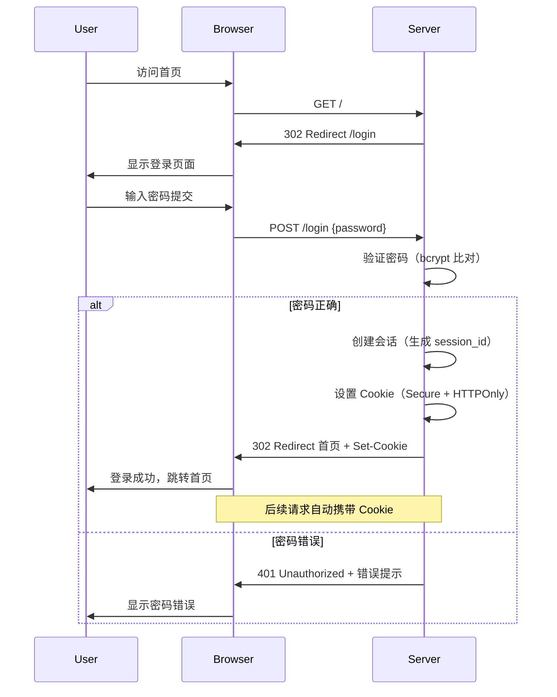

# 🔒 认证配置指南 / Authentication Configuration Guide

GoNote 为单用户部署提供简单的密码保护功能。启用后，用户必须先登录才能访问笔记内容和 API 端点。

---

## ⚠️ 重要警告 / Important Warning

> **默认密码是 `admin`** — 这是完全公开的测试凭据！  
> **在暴露到任何网络（包括局域网）之前，务必修改默认密码！**

---

## 📋 功能概述 / Feature Overview

GoNote 的认证系统特性：

| 特性 (Feature) | 说明 (Description) |
|----------------|-------------------|
| **适用场景** | 单用户 / 自托管部署 |
| **密码存储** | bcrypt 哈希（成本因子 12） |
| **会话管理** | Cookie 基础会话，默认 7 天有效期 |
| **安全性** | HTTPOnly Cookie + SameSite=Lax + 可配置 Secure |
| **CSRF 防护** | Double Submit Cookie 模式 |

---

## 🚀 快速开始 / Quick Start

### 本地测试（3 步启用）

1. **编辑配置文件** `config.yaml`：

```yaml
authentication:
  enabled: true
  password: "admin"  # 仅测试用，生产环境请立即修改
  secret_key: "change_me_to_random_32_char_hex"
```

2. **重启应用**

```bash
# Docker Compose
docker-compose restart

# Docker run
docker restart gonote

# 本地运行
cd go && go run cmd/server/main.go
```

3. **访问应用** `http://localhost:9000` — 自动跳转到登录页面

---

## 🏭 生产环境配置 / Production Setup

对于任何网络暴露的部署，请按以下步骤完成安全配置。

---

### 第 1 步：生成会话密钥

会话密钥用于加密签名 Cookie，确保会话无法被篡改。

**推荐方法（OpenSSL）：**

```bash
openssl rand -hex 32
# 输出示例：a3f8b2c1d4e5f6789012345678901234567890abcdef
```

**备用方法（Docker 容器内）：**

```bash
docker exec -it gonote sh -c 'openssl rand -hex 32'
```

**保存此密钥** — 第 2 步配置需要用到。

---

### 第 2 步：选择密码配置方式

GoNote 支持两种密码配置方式，选择其中一种即可。

---

#### 方案 A：明文密码（推荐，简单）

应用启动时会自动将明文密码哈希存储，无需手动计算。

**方式 1：通过环境变量（Docker / PaaS）**

```bash
docker run -d \
  -e AUTHENTICATION_ENABLED=true \
  -e AUTHENTICATION_PASSWORD=YourStrongPassword123! \
  -e AUTHENTICATION_SECRET_KEY=a3f8b2c1d4e5f6789012345678901234567890abcdef \
  gonote/gonote:latest
```

**方式 2：通过配置文件**

```yaml
# config.yaml
authentication:
  enabled: true
  password: "YourStrongPassword123!"  # 强密码（12+位，混合字符）
  secret_key: "a3f8b2c1d4e5f6789012345678901234567890abcdef"  # 上一步生成的密钥
```

---

#### 方案 B：预哈希密码（高级，更安全）

手动生成 bcrypt 哈希值，避免明文密码出现在配置文件或环境变量中。

**生成密码哈希值：**

```bash
# 使用项目内置工具（推荐）
cd go && go run tools/hash_password.go YourSecurePassword

# 输出示例：
# $2a$12$N9qo8uLOickgx2ZMRZoMy.Mr...（完整哈希值）

# 使用 htpasswd（如果系统已安装）
htpasswd -bnBC 12 "" YourSecurePassword | tr -d ':\n'
```

**配置预哈希密码：**

```yaml
authentication:
  enabled: true
  password_hash: "$2a$12$N9qo8uLOickgx2ZMRZoMy.Mr..."  # 粘贴完整哈希值
  secret_key: "a3f8b2c1d4e5f6789012345678901234567890abcdef"
```

**方案对比：**

| 对比项 | 方案 A（明文） | 方案 B（预哈希） |
|--------|---------------|------------------|
| **便利性** | ✅ 简单，直接写密码 | ❌ 需要先运行哈希工具 |
| **安全性** | ✅ 启动时自动哈希 | ✅ 密码从不以明文出现 |
| **推荐场景** | 日常部署 | 对安全性要求极高的场景 |

---

### 第 3 步：重启并验证

**重启应用：**

```bash
# Docker Compose
docker-compose restart

# Docker run
docker restart gonote

# Docker Compose 完整重启
docker-compose down && docker-compose up -d

# 本地运行（Go 后端）
cd go && go run cmd/server/main.go
```

**验证认证是否生效：**

1. 访问 `http://localhost:9000`（或你的部署地址）
2. 应自动重定向到 `/login` 登录页面
3. 使用设置的密码登录
4. 登录成功后应返回首页，可正常使用应用

**测试 API 认证：**

```bash
# 未认证请求会被拒绝
curl http://localhost:9000/api/notes
# 响应：{"detail":"未认证"} 或 401 状态码

# 登录后获取会话 Cookie，在后续请求中带上
curl -c cookies.txt -X POST http://localhost:9000/login \
  -H "Content-Type: application/json" \
  -d '{"password":"YourSecurePassword"}'

# 使用 Cookie 访问受保护端点
curl -b cookies.txt http://localhost:9000/api/notes
```

---

## ⚙️ 配置优先级 / Configuration Priority

当多个配置来源同时存在时，按以下优先级生效（高优先级覆盖低优先级）：

| 优先级 | 配置来源 | 类型 | 覆盖范围 |
|--------|---------|------|---------|
| 1 | `AUTHENTICATION_PASSWORD` 环境变量 | 明文密码 | 覆盖所有其他密码配置 |
| 2 | `AUTHENTICATION_PASSWORD_HASH` 环境变量 | 预哈希密码 | 覆盖配置文件中的密码 |
| 3 | `config.yaml` 中的 `password` | 明文密码 | 覆盖配置文件中的 `password_hash` |
| 4 | `config.yaml` 中的 `password_hash` | 预哈希密码 | 最低优先级 |

**示例：**  
如果设置了环境变量 `AUTHENTICATION_PASSWORD=secret123`，它会覆盖 `config.yaml` 中任何 `password` 或 `password_hash` 设置。

**注意：** `AUTHENTICATION_SECRET_KEY` 没有优先级机制，任何来源都会**完全替换**之前的密钥值。

---

## 🔒 安全最佳实践 / Security Best Practices

### 1. 使用强密码

密码应满足以下要求：

- ✅ 至少 **12 个字符**（推荐 16+）
- ✅ 包含 **大小写字母**（a-z, A-Z）
- ✅ 包含 **数字**（0-9）
- ✅ 包含 **特殊符号**（!@#$%^&* 等）
- ❌ 避免使用字典词汇、常见序列、个人信息

**强密码示例：**

```
# 好（推荐）
MySecureP@ssw0rd!2025
G0Note!@#456def

# 差（避免）
password123
admin123
qwerty
```

**密码管理器推荐：**

- Bitwarden（开源，免费）
- 1Password
- KeePassXC（本地）

---

### 2. 生成唯一会话密钥

会话密钥必须是：

- ✅ **随机生成**（不要自己编）
- ✅ **32 字节（64 个十六进制字符）**
- ✅ **唯一性**：每个部署使用不同的密钥
- ❌ 不要在不同应用间复用

**生成命令：**

```bash
openssl rand -hex 32
# 输出：64 位十六进制字符串
```

---

### 3. 启用 HTTPS

**必须**在生产环境使用 HTTPS：

```yaml
# config.yaml
authentication:
  secure_cookie: true  # Cookie 仅通过 HTTPS 传输
```

**自动检测 HTTPS：**  
如果未显式设置 `secure_cookie: true`，应用会自动检测：

| 检测方式 | 环境变量 | 触发值 |
|---------|---------|--------|
| HTTPS 标志 | `HTTPS` | `true`、`1`、`on` |
| 反向代理头 | `X_FORWARDED_PROTO` | `https` |
| 允许的源 | `allowed_origins` | 包含 `https://` |

**反向代理配置示例（Nginx）：**

```nginx
location / {
    proxy_pass http://localhost:9000;
    proxy_set_header X-Forwarded-Proto https;
    # 其他设置...
}
```

---

### 4. 保护配置文件安全

**不要将凭据提交到版本控制：**

```bash
# .gitignore 中添加
config.yaml
.env
*.secret
```

**使用环境变量（Docker / PaaS）：**

```bash
# Docker Compose 的 .env 文件（添加到 .gitignore）
AUTH_PASSWORD=YourSecurePassword
AUTH_SECRET_KEY=openssl_rand_hex_32_output
```

**平台密钥管理：**

- Render、Railway 等平台提供"Secret"字段
- Docker Swarm / Kubernetes 使用 secrets 管理
- 避免硬编码在代码或配置文件中

---

## 🎯 配置参考 / Configuration Reference

### 完整配置示例（生产环境）

```yaml
# config.yaml
app:
  name: "GoNote"

authentication:
  enabled: true
  password: "StrongPassword123!@#"  # 或使用 password_hash
  secret_key: "a3f8b2c1d4e5f6789012345678901234567890abcdef"
  session_max_age: 604800  # 7 天（秒）
  secure_cookie: true  # HTTPS 环境启用

server:
  host: "0.0.0.0"
  port: 9000
  allowed_origins: ["https://yourdomain.com"]
  debug: false

rate_limit:
  enabled: true
  max_requests: 30
  window_seconds: 1
```

---

### 所有认证相关环境变量

| 环境变量 | 类型 | 必填 | 说明 | 示例 |
|---------|------|------|------|------|
| `AUTHENTICATION_ENABLED` | 布尔 | 否 | 启用认证 | `true` |
| `AUTHENTICATION_PASSWORD` | 字符串 | 否 | 明文密码 | `MyP@ss123` |
| `AUTHENTICATION_PASSWORD_HASH` | 字符串 | 否 | bcrypt 哈希 | `$2a$12$...` |
| `AUTHENTICATION_SECRET_KEY` | 字符串 | 否* | 会话密钥 | 64 位十六进制 |
| `AUTHENTICATION_SECURE_COOKIE` | 布尔 | 否 | 强制安全 Cookie | `true` |
| `AUTHENTICATION_SESSION_MAX_AGE` | 整数 | 否 | 会话有效期（秒） | `604800` |

> * `SECRET_KEY` 在启用认证时强烈建议设置，否则会话不安全

---

## 📊 认证流程说明 / Authentication Flow



---

## ⚠️ 认证限制说明 / Limitations

### ✅ 认证能保护什么

- ✅ **所有 Web 页面**（首页、笔记、设置等）
- ✅ **所有 API 端点**（`/api/*`）
- ✅ **查看、创建、编辑、删除笔记**
- ✅ **媒体文件访问**（`/api/media/*`）

---

### ❌ 认证不能保护什么

这是**简单的单用户系统**，**不适合**以下场景：

| 场景 | 为什么不适用 | 替代方案 |
|------|-------------|---------|
| 多用户环境 | 无用户管理、无权限控制 | 使用多用户笔记系统（如 Outline、Joplin Server） |
| 无 HTTPS 的公网暴露 | Cookie 可能被窃听 | 必须启用 HTTPS（反向代理） |
| 合规要求（HIPAA、GDPR） | 缺少审计日志、数据隔离 | 使用企业级合规解决方案 |
| 精细权限控制 | 只有全局登录，无角色/权限 | 自定义开发或选择专业产品 |

---

## 🔧 故障排除 / Troubleshooting

### 问题：登录后立即被登出

**可能原因：**

- `SECRET_KEY` 在重启后变更（会话无法解密）
- Cookie 未正确设置（HTTPS 问题）

**解决：**

1. 确保 `SECRET_KEY` 配置不变
2. 如果使用 HTTPS，确认 `secure_cookie: true` 或自动检测生效
3. 清除浏览器 Cookie 后重试

---

### 问题：环境变量不生效

**检查：**

```bash
# 查看容器中环境变量
docker exec gonote env | grep AUTH

# 检查优先级（环境变量 > config.yaml）
# 确保没有设置更高优先级的变量
```

---

### 问题：Docker Compose 配置不生效

**常见错误：**

```yaml
# 错误：环境变量写在错误的位置
environment:
  AUTHENTICATION_ENABLED=true  # ❌ 应该写成 "- KEY=value" 列表

# 正确：
environment:
  - AUTHENTICATION_ENABLED=true
  - AUTHENTICATION_PASSWORD=MyPass123
```

---

### 问题：HTTPS 下 Cookie 不发送

**原因：** `secure_cookie` 未正确启用。

**解决：**

1. 显式设置：

```yaml
authentication:
  secure_cookie: true
```

2. 或确保反向代理发送 `X-Forwarded-Proto: https`

---

## 🔄 关闭认证 / Disabling Authentication

**临时关闭：**

```yaml
authentication:
  enabled: false
```

**重启应用生效：**

```bash
docker-compose restart
# 或
cd go && go run cmd/server/main.go
```

**注意：** 关闭认证后，所有页面和 API 变为公开访问。

---

## 📚 相关文档 / Related Documentation

- [安全指南（SECURITY_CN.md）](../security/SECURITY_CN.md) - 完整安全建议
- [环境变量参考（ENVIRONMENT_VARIABLES_CN.md）](../developer-guide/ENVIRONMENT_VARIABLES_CN.md) - 所有配置项
- [部署指南（DEPLOY_CN.md）](../developer-guide/DEPLOY_CN.md) - 各平台部署步骤
- [API 文档（API_CN.md）](../developer-guide/API_CN.md) - 认证相关 API 端点

---

**文档版本**：v1.0  
**最后更新**：2025 年 1 月  
**适用版本**：GoNote v1.0+
