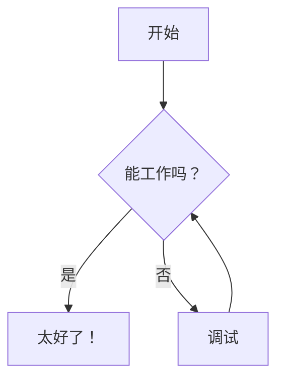

# ✨ GoNote 功能概览

## 📝 笔记管理 / Note Management

### 创建与编辑 / Create & Edit

- **富文本 Markdown 编辑器**，支持实时预览
- **三种视图模式**：编辑模式、分栏模式、预览模式
- **自动保存** — 永远不丢失工作内容
- **撤销/重做** — 支持 Ctrl+Z / Ctrl+Y 快捷键
- **笔记模板** — 从带动态占位符的模板快速创建笔记
- **代码语法高亮** — 支持 50+ 种编程语言
- **一键复制代码块** — 悬停时显示复制按钮
- **LaTeX 数学公式渲染** — 使用 MathJax 渲染精美数学公式（详见 [MATHJAX.md](MATHJAX.md)）
- **Mermaid 图表支持** — 创建流程图、时序图等（详见 [MERMAID.md](MERMAID.md)）
- **HTML 导出** — 将笔记导出为带嵌入图片的独立 HTML 文件
- **公开分享** — 通过令牌 URL 分享笔记，支持 QR 码方便移动端访问（详见 [SHARING.md](SHARING.md)）

---

### 媒体支持 / Media Support

- **拖拽上传** — 直接从文件系统拖放文件到编辑器
- **剪贴板粘贴** — 使用 Ctrl+V 粘贴剪贴板中的图片
- **图片格式** — JPG、PNG、GIF、WebP（最大 10 MB）
- **音频格式** — MP3、WAV、OGG、M4A（最大 50 MB）
- **视频格式** — MP4、WebM、MOV、AVI（最大 100 MB）
- **文档格式** — PDF（最大 20 MB）
- **应用内查看** — 直接在侧边栏预览所有媒体类型
- **内联预览** — 笔记中嵌入音频/视频播放器和 PDF 查看器

---

### 组织管理 / Organization

- **文件夹层级** — 在嵌套文件夹中组织笔记
- **拖拽移动** — 轻松移动笔记和文件夹
- **字母排序** — 快速查找笔记
- **重命名** — 即时重命名文件和文件夹
- **可视化树形视图** — 可展开/折叠的导航结构
- **隐藏系统文件夹** — 切换隐藏 `_attachments`、`_templates` 等下划线前缀文件夹

---

## 🔗 链接与发现 / Linking & Discovery

### 图谱视图 / Graph View

- **交互式图谱** — 可视化所有笔记及其关联关系
- **鼠标导航** — 拖拽平移、滚动缩放、双击节点打开笔记
- **多类型链接** — 区分 Wikilink 和 Markdown 链接，颜色不同
- **主题适配** — 图谱颜色根据当前主题自动调整

---

### 内部链接 / Internal Links

- **Wiki 链接** — `[[笔记名称]]` Obsidian 风格语法，快速链接
- **带显示文本的 Wiki 链接** — `[[笔记名称|点击这里]]` 自定义链接文本
- **章节锚点** — `[[笔记名称#标题]]` 直接链接到标题
- **同页锚点** — `[[#标题]]` 在当前笔记内链接
- **断链检测** — 不存在的笔记链接显示为灰色
- **Markdown 链接** — `[文本](笔记.md)` 标准语法也支持
- **Markdown 章节链接** — `[文本](笔记.md#标题)` 标题锚点
- **拖拽链接** — 拖拽笔记或图片到编辑器插入链接
- **点击导航** — 无缝跳转到目标笔记
- **外部链接** — 自动在新标签页打开

---

### 大纲面板 / Outline Panel

- **目录视图** — 在侧边栏查看所有标题（H1-H6）
- **点击导航** — 在编辑或预览模式下跳转到任意标题
- **实时更新** — 输入时大纲同步更新
- **层级视图** — 缩进显示标题结构
- **标题计数徽章** — 快速了解文档结构

---

### 章节链接语法 / Section Link Syntax

要链接到标题，将标题文本转换为 slug：**小写，空格→短横线，移除特殊字符**。

| 原始标题 | Slug | 链接示例 |
|---------|------|----------|
| `## Getting Started` | `getting-started` | `[[笔记#getting-started]]` |
| `### API Reference` | `api-reference` | `[API](笔记#api-reference)` |
| `## What's New?` | `whats-new` | `[[#whats-new]]`（同页链接） |

---

### 直接 URL / Direct URLs

- **深度链接** — 通过 URL 直接打开特定笔记（如 `/folder/note`）
- **搜索高亮** — 添加 `?search=关键词` 高亮特定内容
- **浏览器历史** — 后退/前进按钮在笔记间导航
- **可分享链接** — 书签或分享带搜索上下文的笔记直链
- **刷新安全** — 页面重载后仍停留在同一笔记，保留搜索上下文
- **复制链接按钮** — 一键复制笔记 URL 到剪贴板
- **最后编辑指示器** — 显示相对上次编辑的时间（如"2 小时前编辑"）
- **收藏夹** — 星标笔记，快速访问；显示在侧边栏顶部

---

## 🎨 自定义 / Customization

### 主题 / Themes

- **16 种内置主题** — 11 种暗色 + 5 种亮色主题
- **主题持久化** — 自动保存您的选择
- **自定义主题** — 创建您自己的 CSS 主题
- **即时切换** — 无需重载页面

---

### 布局 / Layout

- **可调侧边栏** — 拖拽调整宽度
- **视图模式记忆** — 记住编辑/分栏/预览偏好
- **响应式设计** — 适配所有屏幕尺寸

---

## 📊 笔记统计 / Note Statistics

### 统计功能包括

- **字数统计** — 跟踪文档长度
- **字符计数** — 包含和不包含空格两种统计
- **阅读时间** — 估计阅读所需分钟数
- **行数统计** — 笔记总行数
- **图片计数** — 跟踪嵌入图片数量
- **链接计数** — 内部和外部链接（包含 Wikilinks）
- ** Wikilink 计数** — 单独统计 `[[wikilinks]]` 数量
- **可展开面板** — 点击切换统计可见性

---

## 🏷️ 标签 / Tags

使用 YAML frontmatter 中的标签组织笔记。完整指南请参阅 **[TAGS.md](TAGS.md)**。

### 快速开始

```markdown
---
tags: [python, tutorial, backend]
---

# 您的笔记内容
```

---

### 功能亮点

- **点击过滤** — 选择标签显示匹配笔记
- **多标签组合** — 组合标签使用 AND 逻辑（必须全部匹配）
- **标签计数** — 查看每个标签的使用次数
- **可折叠面板** — 跨会话保存状态
- **自动同步** — 保存笔记后自动更新

---

## ⚙️ 笔记属性面板 / Note Properties Panel

在预览中直接查看和交互 YAML frontmatter 元数据。

### 功能特性

- **可折叠面板** — 预览顶部显示紧凑栏，点击展开详情
- **自动隐藏** — 仅在笔记包含 frontmatter 时显示
- **可点击标签** — 点击任意标签过滤笔记
- **智能格式化** — 日期精美显示，布尔值显示为 ✓/✗
- **URL 检测** — 元数据中的链接自动可点击
- **实时更新** — 编辑 frontmatter 时同步变化
- **性能优化** — 缓存解析结果，未更改时不重新解析

---

### 折叠视图 / Collapsed View

显示标签徽章，最多展示 3 个优先字段（日期、作者、状态等）。

### 展开视图 / Expanded View

点击展开，在整洁的网格布局中查看所有元数据字段。

---

### 支持的格式

```yaml
---
tags: [project, important]     # 内联数组
date: 2024-01-15               # 格式化为 "2024 年 1 月 15 日"
author: John Doe               # 字符串值
status: draft                  # 字符串值
priority: high                 # 字符串值
source: https://example.com    # 可点击链接
draft: true                    # 显示为 "✓ 是"
custom-field: any value        # 支持带连字符的键
items:                         # YAML 列表格式
  - item 1
  - item 2
---
```

---

## 🔍 搜索与过滤 / Search & Filtering

### 文本搜索 / Text Search

- **仅搜索内容** — 搜索笔记内容（不含文件/文件夹名）
- **实时结果** — 输入时即时显示匹配结果
- **高亮匹配** — 在搜索结果中查看上下文高亮
- **笔记内高亮** — 打开的笔记中搜索词高亮显示
- **实时高亮更新** — 输入或编辑时高亮同步更新

---

### 组合过滤 / Combined Filtering

- **标签 + 搜索** — 结合文本搜索与标签过滤器
- **智能显示切换** — 过滤时显示扁平列表，浏览时显示树形视图
- **空状态提示** — 清晰的"无匹配"消息加快捷操作提示

---

## 🧮 数学与 LaTeX 支持 / Math & LaTeX Support

### 数学符号 / Mathematical Notation

- **行内数学** — 使用 `$...$` 或 `\(...\)` 在文本中插入公式
- **独立数学** — 使用 `$$...$$` 或 `\[...\]` 显示居中公式块
- **完整 LaTeX 支持** — 基于 MathJax 3 驱动
- **希腊字母** — `\alpha`、`\beta`、`\Gamma` 等
- **矩阵** — `\begin{bmatrix}...\end{bmatrix}` 支持
- **微积分** — 积分、导数、极限符号
- **标准数学符号** — 所有常用数学符号
- **主题适配** — 数学公式颜色与当前主题保持一致

---

### 示例 / Example

```markdown
爱因斯坦方程：$E = mc^2$

求根公式：
$$
x = \frac{-b \pm \sqrt{b^2-4ac}}{2a}
$$
```

📄 **更多示例和语法参考请参阅 [MATHJAX.md](MATHJAX.md)。**

---

## 📊 Mermaid 图表 / Mermaid Diagrams

### 可视化图表类型 / Diagram Types

- **流程图** — 流程图和决策树
- **时序图** — 系统随时间交互的时序关系
- **类图** — UML 类关系图
- **状态图** — 状态机和转换图
- **甘特图** — 项目时间线规划
- **饼图** — 数据可视化
- **Git 图** — 分支和提交历史
- **主题支持** — 图表颜色适配当前主题

---

### 示例 / Example

````markdown

````

📄 **更多图表示例和语法参考请参阅 [MERMAID.md](MERMAID.md)。**

---

## 📄 笔记模板 / Note Templates

使用可重用模板创建笔记，支持动态占位符自动替换。

### 创建模板

1. 在 `data/_templates/` 文件夹中创建 Markdown 文件
2. 使用占位符表示需要动态替换的内容
3. 模板会自动出现在"从模板新建"菜单中

---

### 可用占位符 / Available Placeholders

| 占位符 | 替换为 | 示例 |
|--------|--------|------|
| `{{date}}` | 当前日期（YYYY-MM-DD） | 2025-01-15 |
| `{{time}}` | 当前时间（HH:MM:SS） | 14:30:00 |
| `{{datetime}}` | 完整日期时间 | 2025-01-15 14:30:00 |
| `{{timestamp}}` | Unix 时间戳（秒） | 1736958600 |
| `{{year}}` | 当前年份（YYYY） | 2025 |
| `{{month}}` | 当前月份（MM） | 01 |
| `{{day}}` | 当前日期（DD） | 15 |
| `{{title}}` | 笔记名称（不含扩展名） | weekly-report |
| `{{folder}}` | 父文件夹名称 | reports |

---

### 示例模板

```markdown
---
tags: [meeting]
date: {{date}}
---

# {{title}}

**创建于：** {{datetime}}

## 会议内容

## 行动项

## 下一步计划
```

---

### 使用模板 / Using Templates

1. 点击"新建"下拉按钮
2. 选择"从模板新建"
3. 选择模板并输入笔记名称
4. 新笔记将自动创建，所有占位符替换完成

---

### 内置模板 / Built-in Templates

- **meeting-notes** — 会议笔记模板
- **daily-journal** — 每日日志，含晨间目标和晚间反思
- **project-plan** — 项目规划模板，包含目标和时间线

📚 **详见 [TEMPLATES.md](TEMPLATES.md)** 获取详细文档和可复制到您实例的示例模板。

---

## ⚡ 键盘快捷键 / Keyboard Shortcuts

### 通用快捷键 / General

| Windows/Linux | macOS | 操作 |
|---------------|-------|------|
| `Ctrl+Alt+P` | `Cmd+Option+P` | 快速切换器（跳转到任意笔记） |
| `Ctrl+S` | `Cmd+S` | 保存笔记 |
| `Ctrl+Alt+N` | `Cmd+Option+N` | 新建笔记 |
| `Ctrl+Alt+F` | `Cmd+Option+F` | 新建文件夹 |
| `Ctrl+Z` | `Cmd+Z` | 撤销 |
| `Ctrl+Y` 或 `Ctrl+Shift+Z` | `Cmd+Y` 或 `Cmd+Shift+Z` | 重做 |
| `Ctrl+Alt+Z` | `Cmd+Option+Z` | 切换禅模式 |
| `Esc` | `Esc` | 退出禅模式 |
| `F3` | `F3` | 下一个搜索匹配 |
| `Shift+F3` | `Shift+F3` | 上一个搜索匹配 |

> **Mac 用户注意：** 某些 Option 基础快捷键（`Cmd+Option+N/F/T`）可能与 Chrome/Brave 浏览器快捷键冲突。Safari 兼容性更好。如果快捷键不工作，尝试使用 `Ctrl` 代替 `Cmd`，或使用 UI 按钮。

---

### Markdown 格式化 / Markdown Formatting

| Windows/Linux | macOS | 操作 | 结果 |
|---------------|-------|------|------|
| `Ctrl+B` | `Cmd+B` | 粗体 | `**文本**` |
| `Ctrl+I` | `Cmd+I` | 斜体 | `*文本*` |
| `Ctrl+K` | `Cmd+K` | 插入链接（编辑器中） | `[文本](URL)` |
| `Ctrl+Alt+T` | `Cmd+Option+T` | 插入表格 | 3×3 表格占位符 |

> **提示：** 使用 `Ctrl+Alt+P` 从应用任意位置快速跳转到任意笔记。

---

## 🧘 禅模式 / Zen Mode

全沉浸无干扰写作体验：

- **全屏** — 使用浏览器全屏 API 实现真正沉浸
- **隐藏 UI** — 侧边栏、工具栏和统计栏全部隐藏
- **居中编辑器** — 舒适宽度，最佳阅读体验
- **更大文本** — 18px 字体大小，宽松行距
- **快速访问** — 工具栏按钮或 `Ctrl+Alt+Z` / `Cmd+Option+Z` 快捷键
- **轻松退出** — 按 `Esc`、点击退出按钮，或再次使用快捷键
- **状态保留** — 退出后返回您之前的视图模式

---

## 📱 渐进式 Web 应用（PWA）/ Progressive Web App

GoNote 可作为独立应用安装在您的设备上：

- **安装为应用** — 移动端添加到主屏幕，桌面端通过浏览器安装
- **独立模式** — 无浏览器 chrome 运行，体验接近原生应用

---

### 如何安装 / How to Install

- **桌面端（Chrome/Edge）**：点击地址栏安装图标，或菜单 → "安装 GoNote"
- **Android**：Chrome 菜单 → "添加到主屏幕"
- **iOS**：Safari 分享 → "添加到主屏幕"

---

## 🌍 国际化 / Internationalization

- **多语言支持** — 英语（en-US）、简体中文（zh-CN）等内置语言
- **易于扩展** — 将 JSON 语言文件放入 `locales/` 文件夹即可添加
- **即时切换** — 在设置中更改语言，无需重载页面
- **社区翻译** — 欢迎社区贡献翻译！

---

## 🚀 性能特性 / Performance

- **即时加载** — 无延迟，无加载旋转指示器
- **高效缓存** — 智能本地存储策略
- **最小资源占用** — 在普通硬件上流畅运行
- **无臃肿设计** — 专注核心功能
- **轻量级架构** — 无重型前端框架依赖

---

**💡 探索提示：** 多尝试界面交互！大部分功能通过直观的拖放和悬停菜单即可发现。
