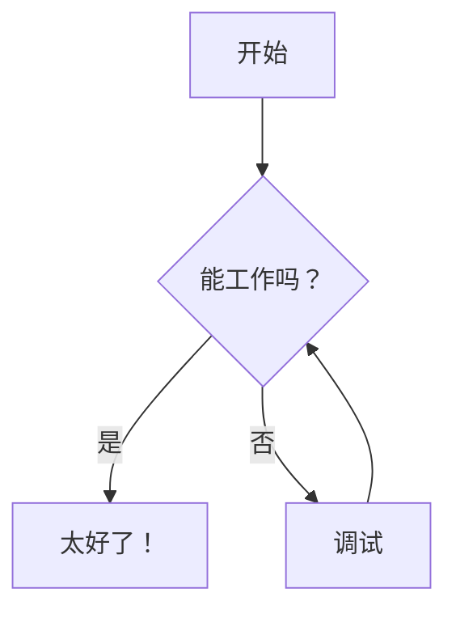

# ✨ 功能列表

## 📝 笔记管理

### 创建与编辑
- **富文本 Markdown 编辑器**，实时预览
- **三种视图模式**：编辑、分栏、预览
- **自动保存**——永远不会丢失工作内容
- **撤销/重做**——支持 Ctrl+Z / Ctrl+Y
- **笔记模板**——从带动态占位符的模板创建笔记
- **代码语法高亮**——支持 50+ 种编程语言
- **复制代码块**——悬停时一键复制
- **LaTeX/数学渲染**——使用 MathJax 渲染精美数学公式（详见 [MATHJAX_CN.md](MATHJAX_CN.md)）
- **Mermaid 图表**——创建流程图、时序图等（详见 [MERMAID_CN.md](MERMAID_CN.md)）
- **HTML 导出**——将笔记导出为带嵌入图片的独立 HTML 文件
- **公开分享**——通过令牌 URL 分享笔记，支持 QR 码方便移动端（详见 [SHARING_CN.md](SHARING_CN.md)）

### 媒体支持
- **拖拽上传**——从文件系统直接拖放文件到编辑器
- **剪贴板粘贴**——使用 Ctrl+V 粘贴剪贴板中的图片
- **图片**——JPG、PNG、GIF、WebP（最大 10MB）
- **音频**——MP3、WAV、OGG、M4A（最大 50MB）
- **视频**——MP4、WebM、MOV、AVI（最大 100MB）
- **文档**——PDF（最大 20MB）
- **应用内查看**——直接在侧边栏查看所有媒体类型
- **内联预览**——笔记中嵌入音频/视频播放器和 PDF 查看器

### 组织管理
- **文件夹层级**——在嵌套文件夹中组织笔记
- **拖拽移动**——轻松移动笔记和文件夹
- **字母排序**——快速查找笔记
- **重命名**——即时重命名文件和文件夹
- **可视化树形视图**——可展开/折叠的导航
- **隐藏系统文件夹**——切换隐藏 `_attachments`、`_templates` 等下划线前缀文件夹

## 🔗 链接与发现

### 图谱视图
- **交互式图谱**——可视化所有笔记及其关联
- **鼠标导航**——拖拽平移、滚动缩放、双击节点打开笔记
- **多种链接类型**——区分 wikilinks 和 markdown 链接，颜色不同
- **主题适配**——图谱颜色适配当前主题

### 内部链接
- **Wikilinks**——`[[笔记名称]]` Obsidian 风格语法，快速链接
- **带显示文本的 Wikilinks**——`[[笔记名称|点击这里]]` 自定义链接文本
- **章节锚点**——`[[笔记名称#标题]]` 直接链接到标题
- **同页锚点**——`[[#标题]]` 在当前笔记内链接
- **断链检测**——不存在的笔记链接显示为灰色
- **Markdown 链接**——`[文本](笔记.md)` 标准语法也支持
- **Markdown 章节链接**——`[文本](笔记.md#标题)` 标题锚点
- **拖拽链接**——拖拽笔记或图片到编辑器插入链接
- **点击导航**——无缝跳转笔记
- **外部链接**——自动在新标签页打开

### 大纲面板
- **目录**——在侧边栏查看所有标题（H1-H6）
- **点击导航**——在编辑或预览模式下跳转到任意标题
- **实时更新**——输入时大纲同步更新
- **层级视图**——缩进显示标题结构
- **标题计数徽章**——快速了解文档结构

### 章节链接语法
要链接到标题，将标题文本转换为 slug：**小写，空格→短横线，移除特殊字符**。

| 标题 | Slug | 链接示例 |
|------|------|----------|
| `## Getting Started` | `getting-started` | `[[note#getting-started]]` |
| `### API Reference` | `api-reference` | `[API](note#api-reference)` |
| `## What's New?` | `whats-new` | `[[#whats-new]]`（同页） |

### 直接 URL
- **深度链接**——通过 URL 打开特定笔记（如 `/folder/note`）
- **搜索高亮**——添加 `?search=term` 高亮特定内容
- **浏览器历史**——后退/前进按钮在笔记间导航
- **可分享链接**——书签或分享带搜索上下文的笔记直链
- **刷新安全**——页面重载后仍停留在同一笔记，保留搜索上下文
- **复制链接按钮**——一键复制笔记 URL 到剪贴板
- **最后编辑指示器**——显示相对上次编辑的时间（如"2 小时前编辑"）
- **收藏夹**——星标笔记，快速访问；显示在侧边栏顶部

## 🎨 自定义

### 主题
- **16 种内置主题**——11 种暗色 + 5 种亮色主题
- **主题持久化**——自动保存您的选择
- **自定义主题**——创建您自己的 CSS 主题
- **即时切换**——无需重载

### 布局
- **可调侧边栏**——拖拽调整宽度
- **视图模式记忆**——记住编辑/分栏/预览偏好
- **响应式设计**——适配所有屏幕尺寸

## 📊 笔记统计

### 内置插件
- **字数统计**——跟踪文档长度
- **字符计数**——包含和不包含空格
- **阅读时间**——估计阅读分钟数
- **行数统计**——笔记总行数
- **图片计数**——跟踪嵌入图片
- **链接计数**——内部和外部链接（包含 wikilinks）
- **Wikilink 计数**——单独统计 `[[wikilinks]]`
- **可展开面板**——切换统计可见性

## 🔌 插件系统

### 可扩展性
- **简易安装**——将 Python 文件放入 `plugins/` 文件夹
- **热重载**——应用重启时检测插件
- **开关控制**——启用/禁用无需删除
- **事件钩子**——响应笔记保存、删除、搜索
- **API 访问**——完全访问后端功能

> **⚠️ 状态更新（2026-03-31）：**
> - **Python 后端（遗留）：** 插件系统功能完整
> - **Go 后端（当前）：** 插件系统**尚未实现**
> - 计划未来开发 Go 原生插件系统

## 🏷️ 标签

使用 YAML frontmatter 中标签组织笔记。完整指南请参阅 **[TAGS_CN.md](TAGS_CN.md)**。

### 快速开始
```markdown
---
tags: [python, tutorial, backend]
---

# 您的笔记内容
```

### 功能
- **点击过滤**——选择标签显示匹配笔记
- **多标签**——组合标签（AND 逻辑——必须全部匹配）
- **标签计数**——查看每个标签使用次数
- **可折叠面板**——跨会话保存状态
- **自动同步**——保存笔记后更新

## ⚙️ 笔记属性面板

在预览中直接查看和交互 YAML frontmatter 元数据。

### 功能
- **可折叠面板**——预览顶部紧凑栏，点击展开
- **自动隐藏**——仅在笔记有 frontmatter 时显示
- **可点击标签**——点击任意标签过滤笔记
- **智能格式化**——日期精美显示，布尔值显示为 ✓/✗
- **URL 检测**——元数据中的链接可点击
- **实时更新**——编辑 frontmatter 时同步变化
- **性能优化**——缓存解析，未更改时不重新解析

### 折叠视图
显示标签徽章加最多 3 个优先字段（日期、作者、状态等）

### 展开视图
点击展开，在整洁的网格布局中查看所有元数据字段。

### 支持的格式
```yaml
---
tags: [project, important]     # 内联数组
date: 2024-01-15               # 格式化为 "2024 年 1 月 15 日"
author: John Doe               # 字符串值
status: draft                  # 字符串值
priority: high                 # 字符串值
source: https://example.com    # 可点击链接
draft: true                    # 显示为 "✓ 是"
custom-field: any value        # 支持带连字符的键
items:                         # YAML 列表格式
  - item 1
  - item 2
---
```

## 🔍 搜索与过滤

### 文本搜索
- **仅内容**——搜索笔记内容（不含文件/文件夹名）
- **实时结果**——输入时即时显示
- **高亮匹配**——在结果中查看上下文
- **笔记内高亮**——打开的笔记中搜索词高亮
- **实时高亮**——输入或编辑时高亮更新

### 组合过滤
- **标签 + 搜索**——结合文本搜索与标签过滤器
- **智能显示**——过滤时显示扁平列表，浏览时显示树形视图
- **空状态**——清晰的"无匹配"消息加快捷操作

## 🧮 数学与 LaTeX 支持

### 数学符号
- **行内数学**——使用 `$...$` 或 `\(...\)` 在文本中插入公式
- **独立数学**——使用 `$$...$$` 或 `\[...\]` 显示居中公式
- **完整 LaTeX 支持**——由 MathJax 3 驱动
- **希腊字母**——`\alpha`、`\beta`、`\Gamma` 等
- **矩阵**——`\begin{bmatrix}...\end{bmatrix}`
- **微积分**——积分、导数、极限
- **符号**——所有标准数学符号
- **主题适配**——数学颜色适配主题

### 示例
```markdown
爱因斯坦方程：$E = mc^2$

求根公式：
$$
x = \frac{-b \pm \sqrt{b^2-4ac}}{2a}
$$
```

📄 **更多示例和语法参考请参阅 [MATHJAX_CN.md](MATHJAX_CN.md)。**

## 📊 Mermaid 图表

### 可视化图表
- **流程图**——流程图和决策树
- **时序图**——系统随时间交互
- **类图**——UML 类关系
- **状态图**——状态机和转换
- **甘特图**——项目时间线
- **饼图**——数据可视化
- **Git 图**——分支和提交历史
- **主题支持**——适配您的主题

### 示例
````markdown

````

📄 **更多图表示例和语法参考请参阅 [MERMAID_CN.md](MERMAID_CN.md)。**

## 📄 笔记模板

使用可重用模板创建笔记，带动态占位符替换。

### 创建模板
1. 在 `data/_templates/` 文件夹中创建 Markdown 文件
2. 使用占位符表示动态内容
3. 模板会出现在"从模板新建"菜单中

### 可用占位符
- `{{date}}`——当前日期（YYYY-MM-DD）
- `{{time}}`——当前时间（HH:MM:SS）
- `{{datetime}}`——当前日期和时间
- `{{timestamp}}`——Unix 时间戳
- `{{year}}`——当前年份（YYYY）
- `{{month}}`——当前月份（MM）
- `{{day}}`——当前日期（DD）
- `{{title}}`——笔记名称（不含扩展名）
- `{{folder}}`——父文件夹名称

### 示例模板
```markdown
---
tags: [meeting]
date: {{date}}
---

# {{title}}

**创建于：** {{datetime}}

## 笔记

```

### 使用模板
1. 点击"新建"下拉按钮
2. 选择"从模板新建"
3. 选择模板并输入笔记名称
4. 新笔记将创建，占位符自动替换

### 内置模板
- **meeting-notes**——会议笔记模板
- **daily-journal**——每日日志，含晨间目标和晚间反思
- **project-plan**——项目规划模板，含目标和时间线

📚 **详见 [TEMPLATES_CN.md](TEMPLATES_CN.md)** 获取详细文档和可复制到您实例的示例模板。

## ⚡ 键盘快捷键

### 通用

| Windows/Linux | Mac | 操作 |
|---------------|-----|--------|
| `Ctrl+Alt+P` | `Cmd+Option+P` | 快速切换器（跳转到任意笔记） |
| `Ctrl+S` | `Cmd+S` | 保存笔记 |
| `Ctrl+Alt+N` | `Cmd+Option+N` | 新建笔记 |
| `Ctrl+Alt+F` | `Cmd+Option+F` | 新建文件夹 |
| `Ctrl+Z` | `Cmd+Z` | 撤销 |
| `Ctrl+Y` 或 `Ctrl+Shift+Z` | `Cmd+Y` 或 `Cmd+Shift+Z` | 重做 |
| `Ctrl+Alt+Z` | `Cmd+Option+Z` | 切换禅模式 |
| `Esc` | `Esc` | 退出禅模式 |
| `F3` | `F3` | 下一个搜索匹配 |
| `Shift+F3` | `Shift+F3` | 上一个搜索匹配 |

> **Mac 用户注意：** 某些 Option 基础快捷键（`Cmd+Option+N/F/T`）可能与 Chrome/Brave 浏览器快捷键冲突。Safari 兼容性更好。如果快捷键不工作，尝试使用 `Ctrl` 代替 `Cmd`，或使用 UI 按钮。

### Markdown 格式化

| Windows/Linux | Mac | 操作 | 结果 |
|---------------|-----|--------|--------|
| `Ctrl+B` | `Cmd+B` | 粗体 | `**text**` |
| `Ctrl+I` | `Cmd+I` | 斜体 | `*text*` |
| `Ctrl+K` | `Cmd+K` | 插入链接（在编辑器中） | `[text](url)` |
| `Ctrl+Alt+T` | `Cmd+Option+T` | 插入表格 | 3x3 表格占位符 |

> **提示：** 使用 `Ctrl+Alt+P` 从应用任意位置快速跳转到任意笔记。

## 🧘 禅模式

全沉浸无干扰写作体验：

- **全屏**——使用浏览器全屏 API 实现真正沉浸
- **隐藏 UI**——侧边栏、工具栏和统计栏消失
- **居中编辑器**——舒适宽度，最佳阅读体验
- **更大文本**——18px 字体大小，宽松行距
- **快速访问**——工具栏中的按钮或 `Ctrl+Alt+Z` / `Cmd+Option+Z` 快捷键
- **轻松退出**——按 `Esc`、点击退出按钮，或再次使用快捷键
- **状态保留**——退出后返回您之前的视图模式

## 📱 渐进式 Web 应用（PWA）

GoNote 可作为独立应用安装在您的设备上：

- **安装为应用**——在移动端添加到主屏幕，或在桌面端通过浏览器安装
- **独立模式**——无浏览器 chrome 运行，感觉像原生应用

### 如何安装
- **桌面端（Chrome/Edge）**：点击地址栏中的安装图标，或菜单 → "安装 GoNote"
- **Android**：Chrome 菜单 → "添加到主屏幕"
- **iOS**：Safari 分享 → "添加到主屏幕"

## 🌍 国际化

- **多语言**——英语（en-US）、简体中文（zh-CN）
- **易于添加**——将 JSON 文件放入 `locales/` 文件夹
- **即时切换**——在设置中更改语言，无需重载
- **社区翻译**——欢迎贡献！

## 🚀 性能

- **即时加载**——无延迟，无加载旋转
- **高效缓存**——智能本地存储
- **最小资源**——在普通硬件上运行
- **无臃肿**——专注核心功能
- **轻量级**——无重型框架

---

💡 **提示：** 探索界面！大多数功能通过直观的拖放和悬停菜单即可发现。
