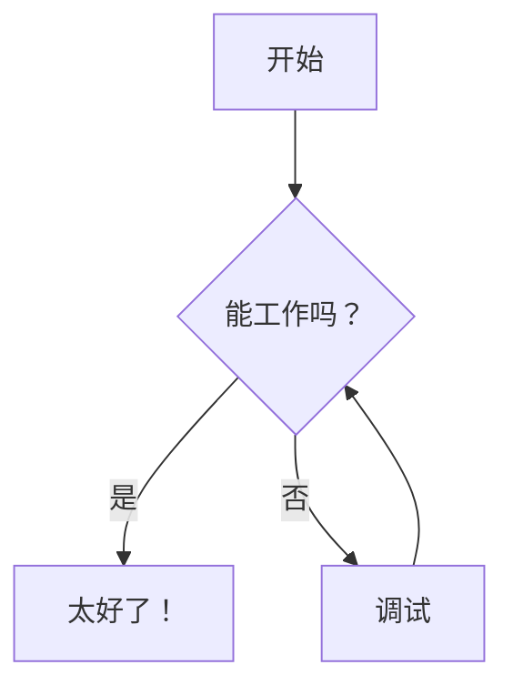
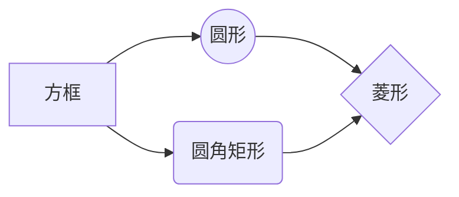
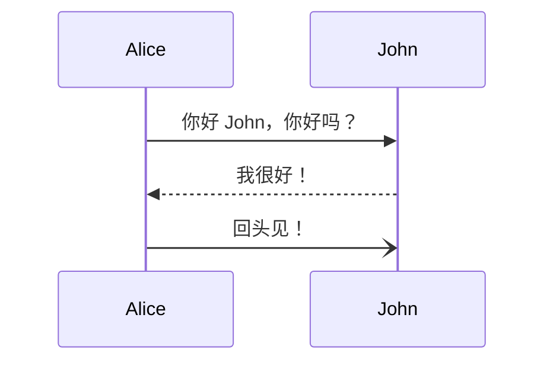
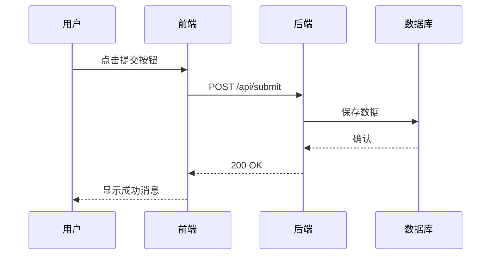
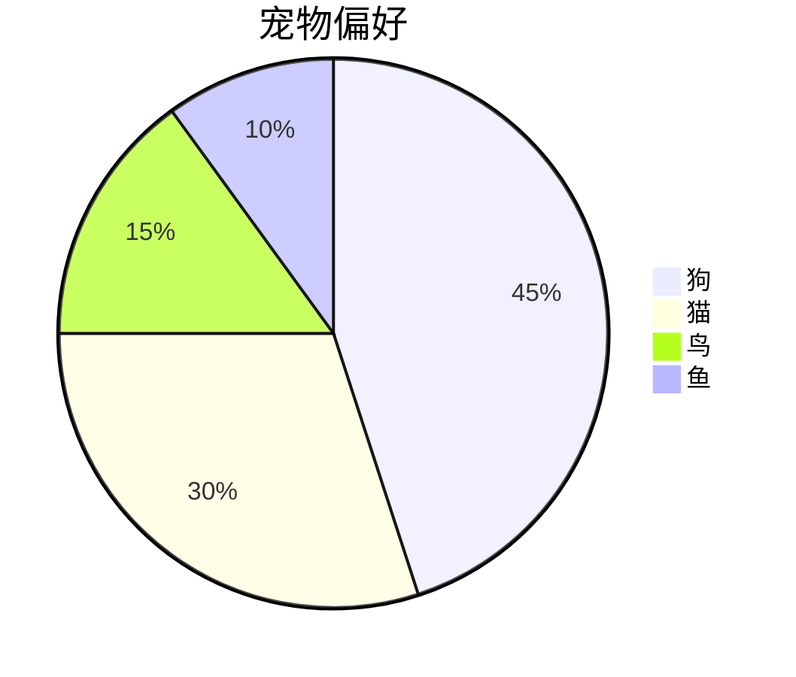
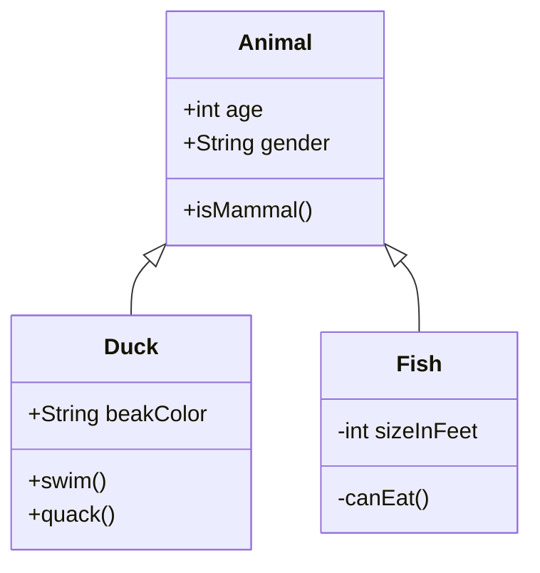
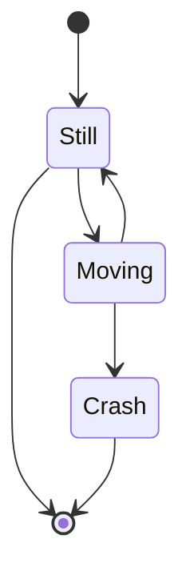
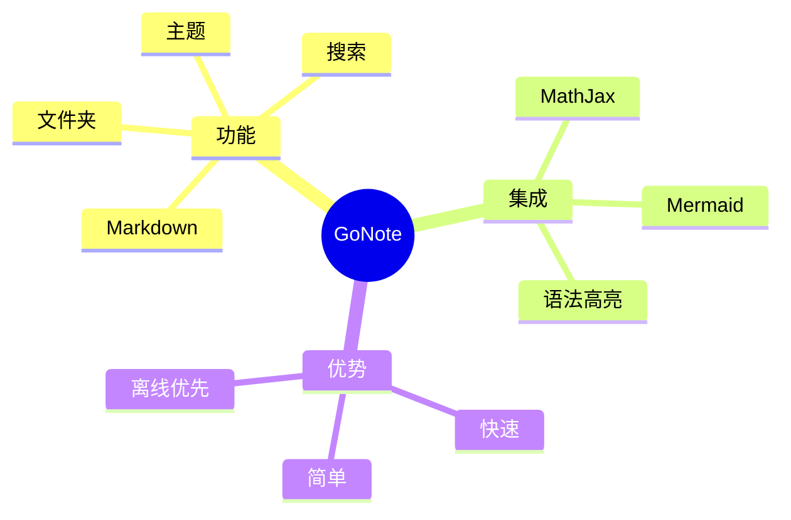
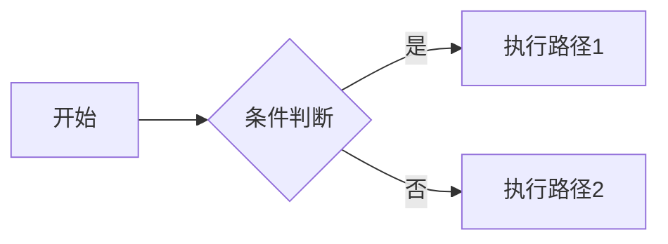

# 📊 Mermaid 图表

在 Markdown 笔记中创建丰富的可视化图表，无需离开编辑器。

---

## 🎯 为什么使用 Mermaid？

- ✅ **纯文本编写** — 图表用代码描述，易于版本控制
- ✅ **版本友好** — Git diff 清晰显示图表变更
- ✅ **快速修改** — 修改文本即可更新图表
- ✅ **多种类型** — 流程图、时序图、甘特图等 10+ 类型
- ✅ **主题适配** — 自动匹配当前界面主题

---

## 🚀 快速开始

### 基本语法

创建代码块，语言设置为 `mermaid`：

````markdown

````

渲染效果：


---

## 📈 支持的图表类型

| 图表类型 | 用途 | 入门语法 |
|---------|------|---------|
| **流程图** | 业务流程、决策流 | `graph TD/LR` |
| **时序图** | 系统交互、消息传递 | `sequenceDiagram` |
| **类图** | UML 类关系 | `classDiagram` |
| **状态图** | 状态机、状态转换 | `stateDiagram-v2` |
| **甘特图** | 项目时间线 | `gantt` |
| **饼图** | 数据占比 | `pie` |
| **Git 图** | 分支提交历史 | `gitGraph` |
| **用户旅程** | 用户体验流程 | `journey` |
| **思维导图** | 头脑风暴、分类 | `mindmap` |
| **实体关系图** | 数据库模型 | `erDiagram` |

---

## 🔄 流程图（最常用）

### 基础流程图

````markdown

````

渲染：


---

### 方向说明

- `graph LR` — 从左到右（Left → Right）
- `graph TD` — 从上到下（Top → Down，默认）
- `graph RL` — 从右到左
- `graph BT` — 从下到上

---

### 节点形状

| 形状 | 语法 | 示例 |
|------|------|------|
| 矩形 | `[文本]` | `[开始]` |
| 圆角矩形 | `(文本)` | `(步骤)` |
| 圆形 | `((文本))` | `((端点))` |
| 菱形/判断 | `{文本}` | `{条件?}` |
| 六边形 | `{{文本}}` | `{{判断}}` |
| 平行四边形 | `[/文本/]` | `[/输入/]` |
| 梯形 | `[\文本\]` | `[\输出\]` |

---

### 连线与箭头

```mermaid
graph LR
    A --> B       # 实线箭头
    A -.-> B      # 虚线箭头
    A --- B       # 无箭头实线
    A -- 文本 --> B  # 带标签
```

**箭头类型：**

| 类型 | 语法 | 说明 |
|------|------|------|
| 实线箭头 | `-->` | 标准流程 |
| 虚线箭头 | `-.->` | 可选流程 |
| 无箭头 | `---` | 仅连接 |
| 粗箭头 | `==>` | 强调重要流程 |

---

## 🎭 时序图（Sequence Diagram）

展示对象之间的交互时序。

### 基础示例

````markdown

````

渲染：


---

### 参与者与消息



**语法：**

- `participant 名称` — 定义参与者
- `A->>B: 消息` — 实线箭头（同步）
- `A-->>B: 消息` — 虚线返回
- `A-)B: 消息` — 开放箭头（异步）
- `A-xB: 消息` — 销毁

---

## 📦 甘特图（Gantt Chart）

项目时间线规划。

### 示例

````markdown
```mermaid
gantt
    title 项目时间线
    dateFormat YYYY-MM-DD
    section 规划
    需求调研 :a1, 2024-01-01, 30d
    原型设计 :after a1, 20d
    section 开发
    后端开发 :2024-02-01, 40d
    前端开发 :2024-02-15, 35d
    section 测试
    集成测试 :2024-03-20, 15d
    用户验收测试 :after 集成测试, 10d
```
````

渲染：

```mermaid
gantt
    title 项目时间线
    dateFormat YYYY-MM-DD
    section 规划
    需求调研 :a1, 2024-01-01, 30d
    原型设计 :after a1, 20d
    section 开发
    后端开发 :2024-02-01, 40d
    前端开发 :2024-02-15, 35d
    section 测试
    集成测试 :2024-03-20, 15d
    用户验收测试 :after 集成测试, 10d
```

**语法：**

- `title` — 图表标题
- `dateFormat` — 日期格式（必须）
- `section` — 分组/阶段
- `任务名 :id, 开始日期, 持续时间` — 任务定义
- `after 其他任务` — 相对时间

---

## 🥧 饼图（Pie Chart）

数据占比可视化。

### 示例

````markdown

````

渲染：


---

## 🏗️ 类图（Class Diagram）

UML 类关系展示。

### 示例

````markdown

````

渲染：


---

## 🔄 状态图（State Diagram）

状态机与状态转换。

### 示例

````markdown

````

渲染：


---

## 🧠 思维导图（Mindmap）

知识结构与分类展示。

### 示例

````markdown

````

渲染：


---

## 🛠️ 主题适配

Mermaid 图表自动适配当前 GoNote 主题：

- 🌞 **亮色主题** — 使用 Mermaid 默认配色
- 🌙 **暗色主题** — 自动切换为暗色优化配色
- 🔄 **主题切换** — 自动重新渲染所有图表

---

## 💡 实用技巧

### 1. 保持简单

从基础图表开始，按需增加复杂度。过于复杂的图表难以维护。

---

### 2. 使用注释

在 Mermaid 代码中添加注释（`%%`）：

````markdown

````

---

### 3. 在线测试

使用[Mermaid Live Editor](https://mermaid.live/)在线编辑和预览图表，复制代码到 GoNote。

---

### 4. 导出与分享

- 导出 HTML 时，Mermaid 图表会以内嵌 SVG 形式包含
- 无需额外依赖，分享链接中图表正常显示
- 可右键保存 SVG 图片用于其他用途

---

## 🔗 更多资源

### 官方文档

- [Mermaid 官方文档](https://mermaid.js.org/) — 完整语法和示例
- [Mermaid Live Editor](https://mermaid.live/) — 在线实时编辑

---

### 快速参考

常用图表类型速查：

| 图表类型 | 关键字 | 适用场景 |
|---------|--------|---------|
| 流程图 | `graph` | 流程、架构图 |
| 时序图 | `sequenceDiagram` | 交互、API 调用 |
| 类图 | `classDiagram` | 面向对象设计 |
| 甘特图 | `gantt` | 项目计划 |
| 饼图 | `pie` | 数据占比 |
| 状态图 | `stateDiagram-v2` | 状态机 |
| 思维导图 | `mindmap` | 知识整理 |

---

## 🎨 搭配 LaTeX 使用

Mermaid 可与 LaTeX 公式结合：

````markdown
```mermaid
graph LR
    A[输入 x] --> B{计算 $f(x) = x^2$}
    B --> C[输出 y]
```
````

---

**开始创建您的第一个图表吧！** 📊
