# Mermaid 图表

GoNote 支持直接在 Markdown 笔记中创建 **Mermaid** 图表！Mermaid 允许您使用基于文本的定义创建图表和可视化，使其易于版本控制和协作。

## 如何使用

只需创建一个代码块，语言设置为 `mermaid`：

````markdown
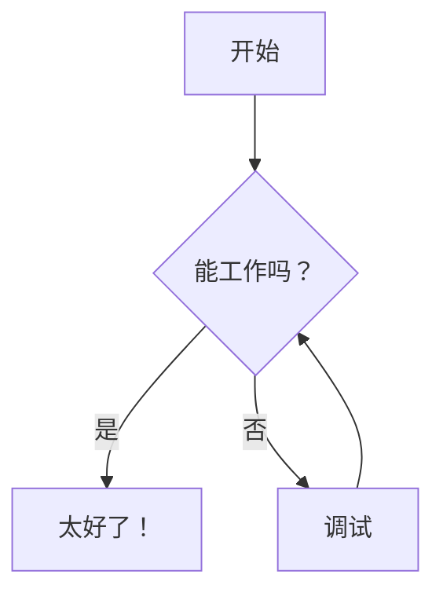
````

## 基础示例

### 流程图

````markdown
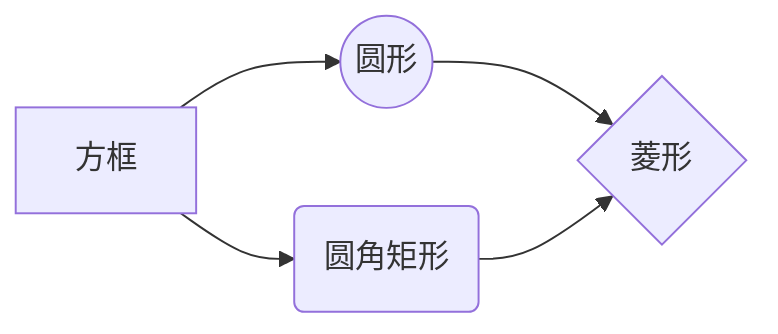
````

**预览：**


---

### 时序图

````markdown
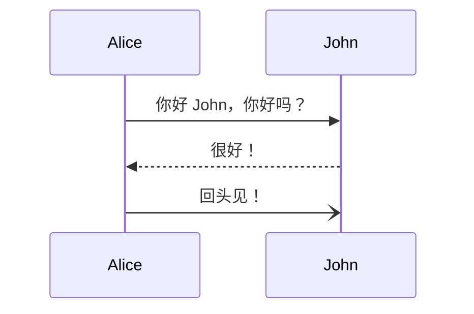
````

**预览：**


---

### 类图

````markdown
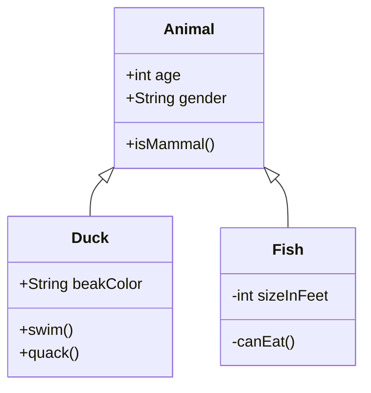
````

**预览：**


---

### 状态图

````markdown
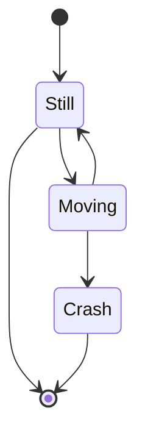
````

**预览：**


---

### 甘特图

````markdown
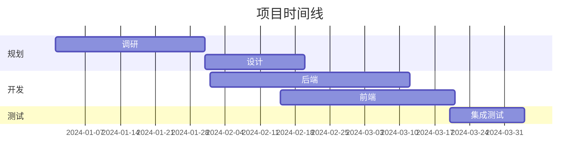
````

**预览：**


---

### 实体关系图

````markdown
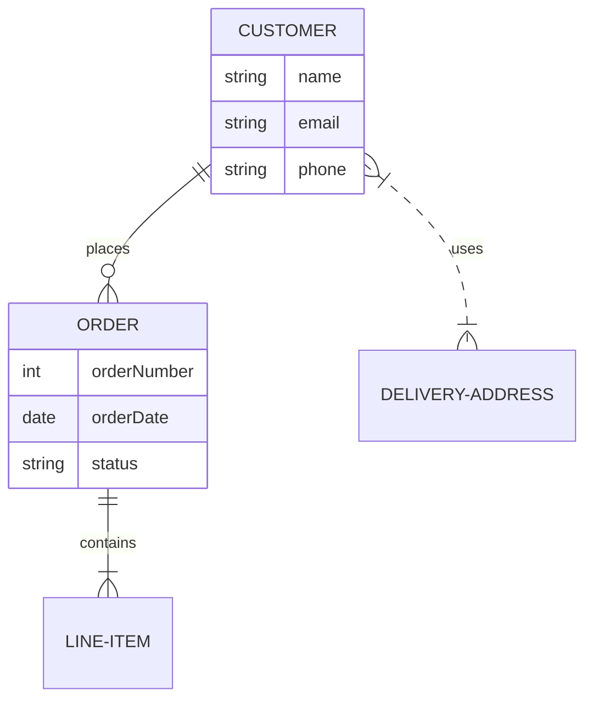
````

**预览：**


---

### 饼图

````markdown
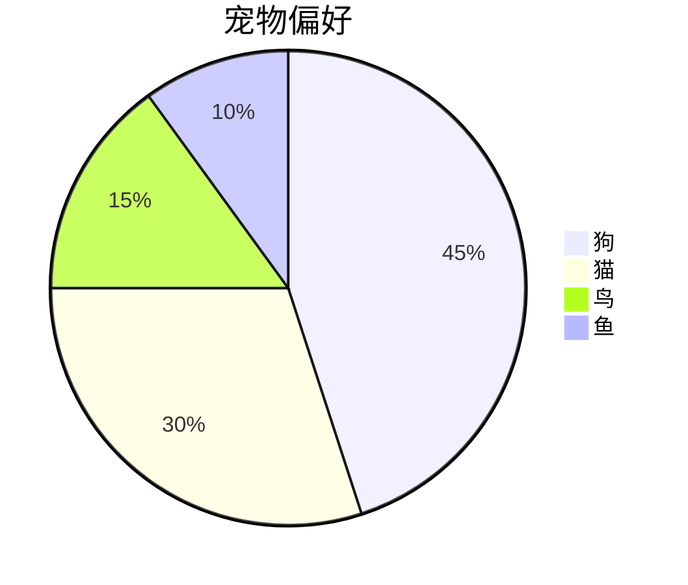
````

**预览：**


---

### Git 图

````markdown

````

**预览：**

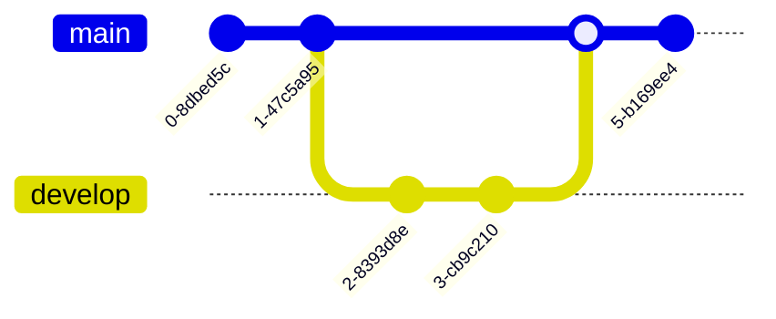

---

### 用户旅程

````markdown
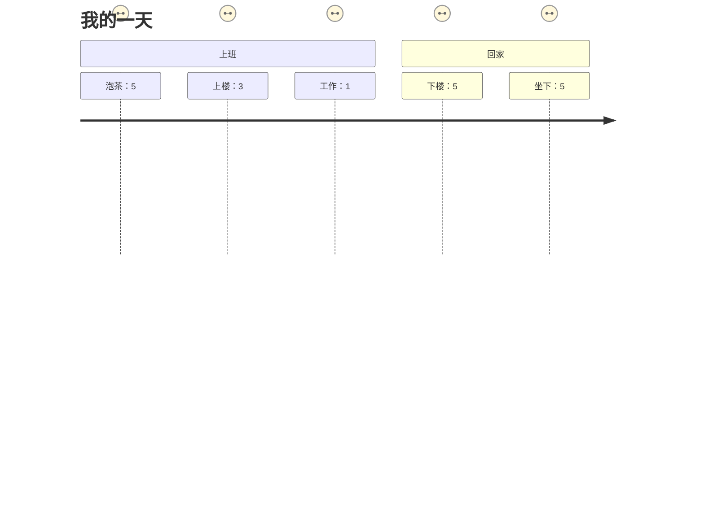
````

**预览：**


---

### 思维导图

````markdown
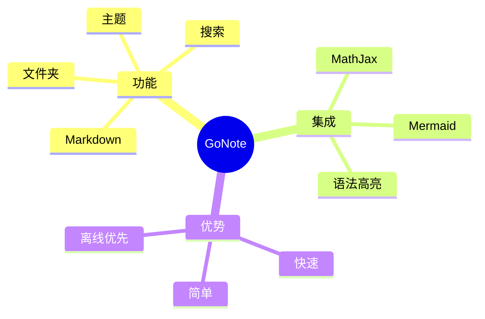
````

**预览：**

```mermaid
mindmap
  root((GoNote))
    功能
      Markdown
      主题
      搜索
      文件夹
    集成
      MathJax
      Mermaid
      语法高亮
    优势
      快速
      简单
      离线优先
```

---

## 主题支持

Mermaid 图表自动适配当前 GoNote 主题：
- **亮色主题**使用默认 Mermaid 配色方案
- **暗色主题**使用暗色优化颜色，确保适当对比度
- 主题更改会自动重新渲染所有图表

## 提示

1. **保持简单**：从基础图表开始，按需增加复杂度
2. **使用注释**：在 Mermaid 代码中添加 `%%` 作为注释
3. **测试语法**：如果图表未渲染，检查 Mermaid [文档](https://mermaid.js.org/)
4. **导出**：导出笔记为 HTML 时包含图表

## 更多信息

完整 Mermaid 语法和更多图表类型，请访问官方文档：
- [Mermaid 文档](https://mermaid.js.org/)
- [在线编辑器](https://mermaid.live/)——在线测试您的图表

---

**专业提示**：将 Mermaid 图表与 LaTeX 数学表达式和代码块结合，实现全面的技术文档！📊
